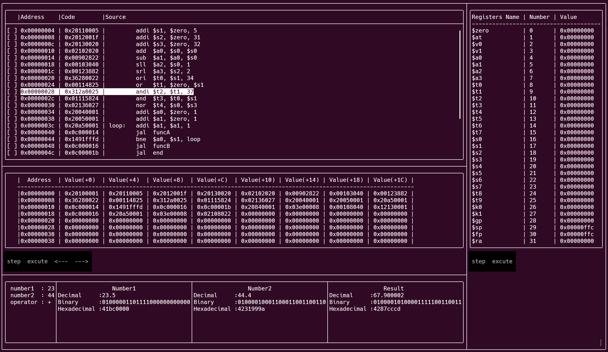

# MIPS_simulator

### build using cmake

```
cd build
cmake -G "MinGW Makefiles" ..\src
cmake --build .
.\bin\MIPS_simulator.exe
````

### Attention


Write the files to be compiled and decompiled in the IO folder, please make sure to add a space after each comma.

### How to use



On the right side are the values of each register. Click the step button to execute in one step, and click the execute button to run (only one can be selected, do not press the step button frantically).

The upper left side is the instruction for writing, which can be swiped to browse.

The memory is located in the middle of the left side. Click the step button to execute in one step, click the execute button to run (only one can be selected, do not press the step button frantically), and use the last two buttons to turn pages.

The lower left side is the floating-point operation unit. If it is not displayed completely, please pull the dividing line to the right.
```
